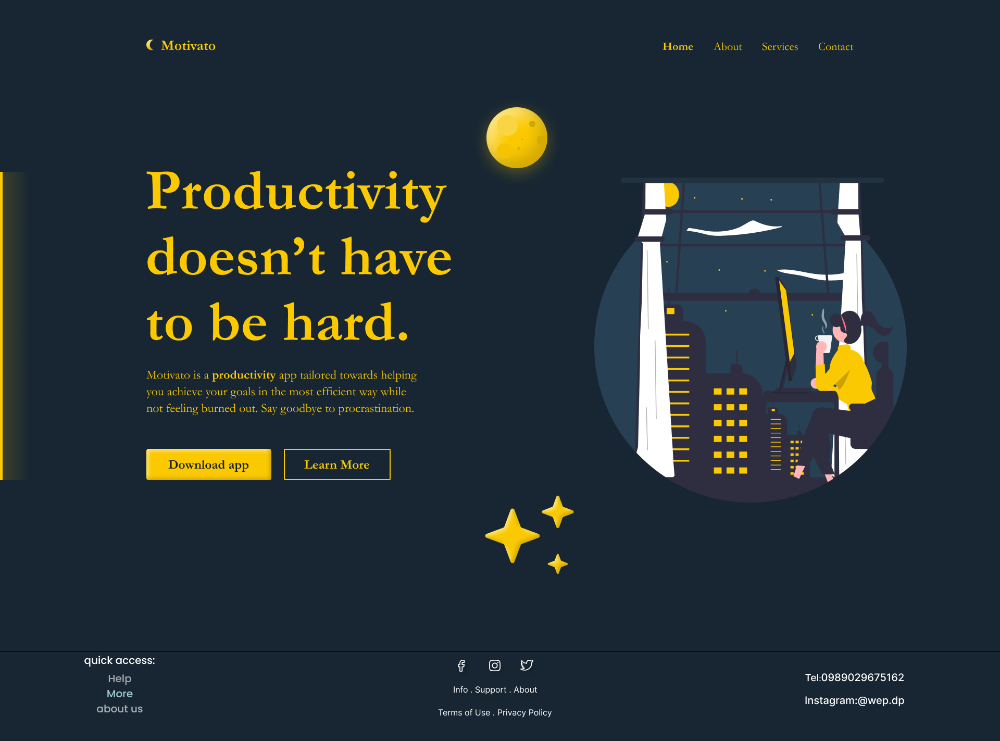

# html and css review lab

In this lab you are required to use your knowledge in html and css to implement one of the designs below (depending on your group) you are timed against the other group 

## a couple of notes
- to view the design in the best way possible (with pixels and everything) you need to create a figma account (you can sign in using google)
- you are also required to have a dark mode (choose you own colors for that just make sure the design is pleasant to the eye)

## prize
the winning group gets a *discount* in the **today's** homework

Group A
https://www.figma.com/file/aKTryy1VbL341pBQHv77y7/Motivato-Community

Group B
https://www.figma.com/file/PSVZ2xE2kG3FDi7zFaevaO/trade-Community

Remember to have fun :)
Good Luck
